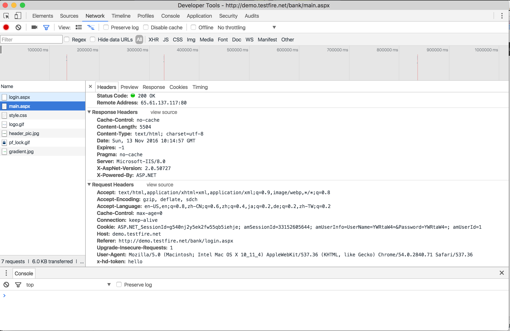
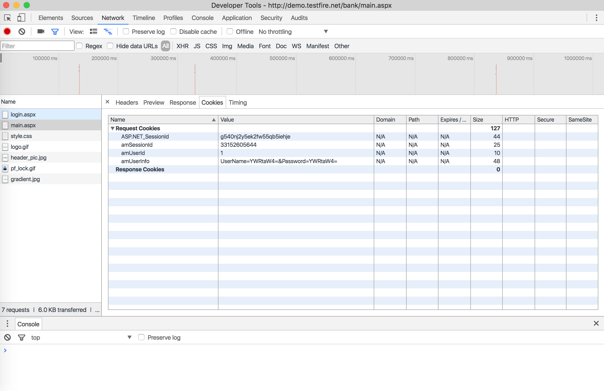

# Vulnerability One 

> Site used : http://demo.testfire.net/

> Vulnerability Name: SQL injection vulnerability

> Tools used: Google Chrome Developer's Tool 

## Steps to discover the vulnerability

1. Login to the bank website use `username: admin` and `password: admin`
2. Open the Google Chrome's Developer's Console and click on Network Tab and Cookies Tab

## Screenshots for the vulnerability: 

> Network

    

> Cookies

    

## Steps taken to exploit the vulnerability:

From the screenshots above, we could find that the when a user login, he or she will be redirect to a page `main.aspx`, and session information, together with an variable `amUserId` will be stored locally into cookie. It seems that `userId` is just something stored on cookies and we can take advantage of it to obtain data from the database. We can add sql queries after the `amUserId` and send a GET request to the server again using our username and password. The data we can obtained depends on the query. For example, we can obtain all account information by union this query with the whole table. 

## InfoSec Triad the attack aimed at

From the description above, we can see that such attack made data that supposed to be credential to public available to public, it override **confidentiallity** of classic InfoSec Triad by exposing confidentail data to public. 

## Attack Type

Since the information of username and password should be confidential to a normal user, the attack describing above belongs to **Interception Attack** 

## Active/Passive

The attack is aimed at obtaining user account information and taking advantage of them later, it is a **passive attack**.

## Steps to fix the vulnerability

One way to prevent sql injection attack is to use a **Parameterized Query**. Parameterized Query will bind certain data to query that is set in inner of the software. Parameterized Query can only take certain parameter coming from user request, so the appended sql will be ignored or the dangerous request from user will be rejected. 

## Reference 

[BLOG.DORNEA.NU](http://blog.dornea.nu/2013/05/06/hacking-altoro-mutual/#1893267eeefa97c21a09c4e6d7d15585)

