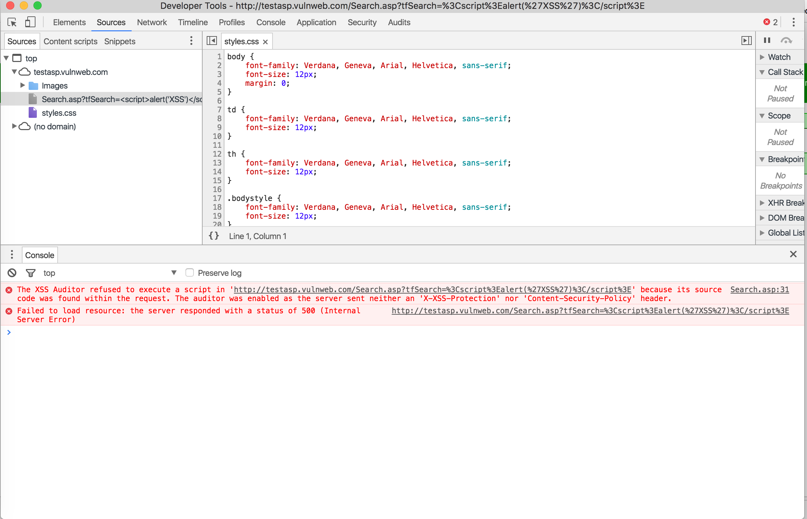
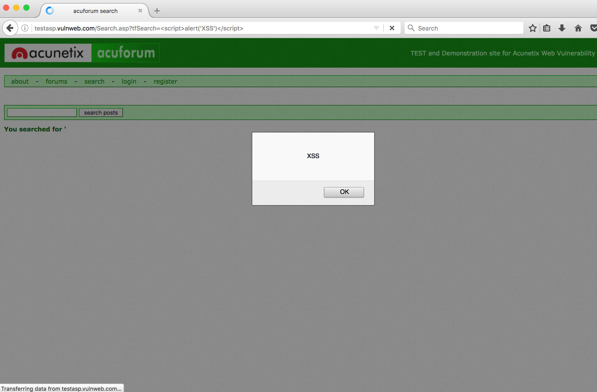

# Vulnerability Three 

> Site used : http://testasp.vulnweb.com

> Vulnerability Name: XSS - DOM-based Cross-Site Scripting

> Tools used: Google Chrome, Firefox 

## Steps to discover the vulnerability

**Note: please use firefox to allow XSS** 

1. Go to http://testasp.vulnweb.com
2. Click on the search tab
4. Type something in the search bar, then press enter 
5. We find that the url turns to `?tfSearch=`, so we can take advantage of this to create some script to be execute from changing the URL 

## Screenshots for the vulnerability

> Google Chrome has "XSS Auditor" for prevent client side scripting, so it will not work 

    

> Firefox XSS vulnerability screenshot

    

## Steps taken to exploit the vulnerability

From the screen shot we can see that if we append a ``, then we can add a alert box to the website and tool advantage of the data entered by user. 

## InfoSec Triad the attach aimed at 

From the description above, the hacker is trying to modifying the "DOM environment" of the website. So this break the availability of resource of the website, and also may possiblly modified information been sended to server. I considered it to be a combination of **availability and integrity** attack.

## Attack Type

Since in the hacking process above, hacker is trying to insert a new DOM element that previously does not exist on the page, so it is a **fabrication attack**

## Active/Passive

Since the hacker is affecting the "DOM Environment" so it is a **Active** attack.

## Steps to fix the vulnerability

Since all xss attack execute in client side, the DOM-XSS vulnerability can be fixed by encoding html tag using an encoders you specified. So when the hacker is trying to insert a DOM element, since the tag is not encoded, the dom element will not rendering. 

## References

[XSS (Cross Site Scripting) Prevention Cheat Sheet](https://www.owasp.org/index.php/XSS_(Cross_Site_Scripting)_Prevention_Cheat_Sheet)

[DOM Based XSS](https://www.owasp.org/index.php/DOM_Based_XSS)

