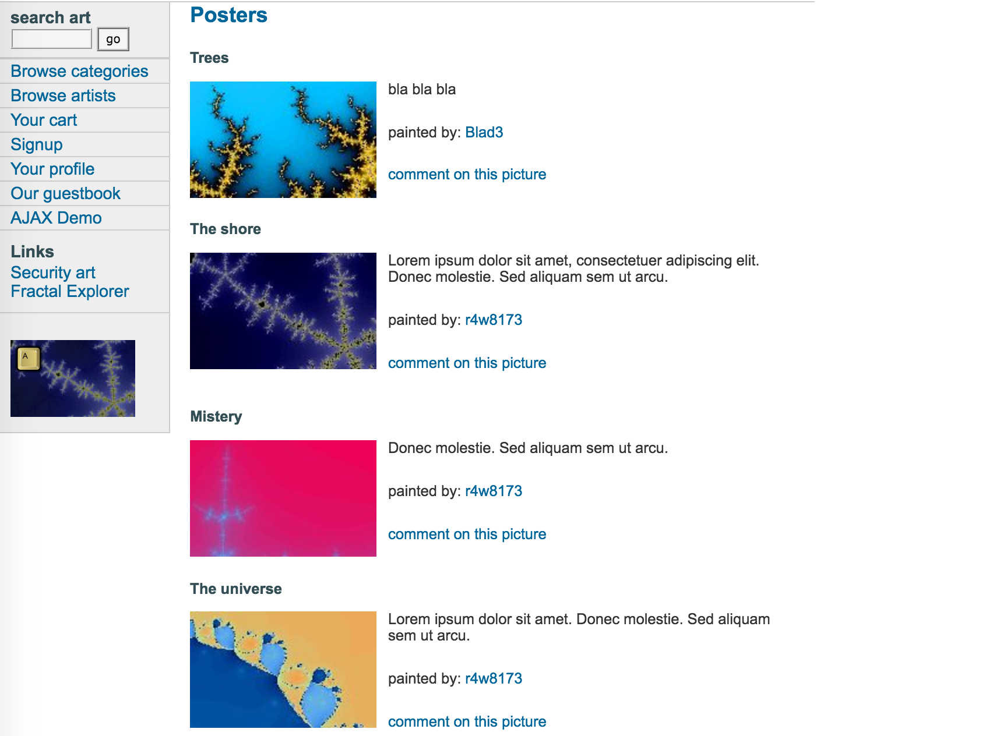

# Vulnerability Two

> Site used : http://testphp.vulnweb.com/
> Vulnertability Name: SQL injection vulnerability. 
> Tool Used: Google Chrome Browser


## Steps to discover the vulnerability:

1. Go to http://testphp.vulnweb.com/
2. Make a query by add parameter to the url, for example, type : http://testphp.vulnweb.com/listproducts.php?cat=1'. The ' at the end of the query is to test how the server handle bad input 

## Screenshots for the vulnerability

> Error message show on the main area of the webiste 

<div style="text-align: center;">
    
</div>

## Steps taken to exploit the vulnerability

From the error message displayed in the screenshot, we can see many keywords that related to database, such as "boolean", "listproducts.php". So the table related to list product might be vulnerable. We can try something with the table used to list products. 

1. *Use `ORDER BY` query to detect the maximum column number of the table*: this is a basic technique that is easy to understand. Since if we query for ordering the query result using a column that does not exist, it will be an eror again and we will know the maximum number of columns in the table by keep trying different number. 

2. *Try url like `http://testphp.vulnweb.com/listproducts.php?cat=1+order+by+8`*: we can change the number

> Result for 8

<div style="text-align: center;">
    
</div>

> Result for 9 

<div style="text-align: center;">
    
</div>

> Result for 11

<div style="text-align: center;">
    
</div>

> Result for 12

<div style="text-align: center;">
    
</div>

3. So we can see an error message appeared again when we add a query of order by 12, so we now know that the maximum number of columns in this table is 11. 

4. We can identify which column/columns of the 11 columns is vulnerable, we can use **UNION** to combine query result. So we can try, to see which column is vulnerable, since we give customized name to all the columns been selected, it will be easier to identify them. 

```sql

   http://testphp.vulnweb.com/listproducts.php?cat=1+union+select+'vuln1','vuln2','vuln3','vuln4','vuln5','vuln6','vuln7','vuln8','vuln9','vuln10','vuln11'  
```

> Query result screenshot: 

<div style="text-align: center;">
    
</div>

So we know that the 2nd, 7th and 9th column is vulnerable for injection of our own varaible. 

## InfoSec Triad the attack aimed at 

Since user can easily inject data into the table to affect the database, this attack aimed at **Integrity** of data, it is attempting modify the data in an unanthorized and unprotected manner. 

##  Attack Type

Since the hacker is trying to modify the website which is not authorized, this is a **modification attack**. 

## Active/Passive

The hacker is trying to insert data into database, so this is an **Active** attack. 

## Steps to fix the vulnerability

The vulnerability I described in vulnerability one is also a type of sql injection, the solution is to use **Parameterized Query** at that time. The Parameterized Query solution is more of a type of solution applied middleware and backend of the application. However, the sql injection vulnerability can also be relieved in client-side. For example, we can put some data check on the user's input when user are filling data in a form or making a request. 

## Reference 

[Basic SQL and PHP injection Tutorial](http://www.bommachine.co.uk/sqli/)


